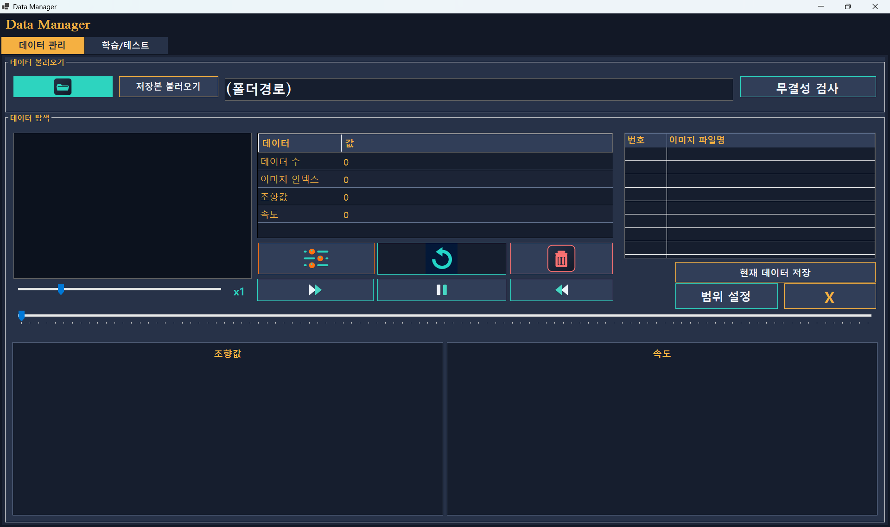
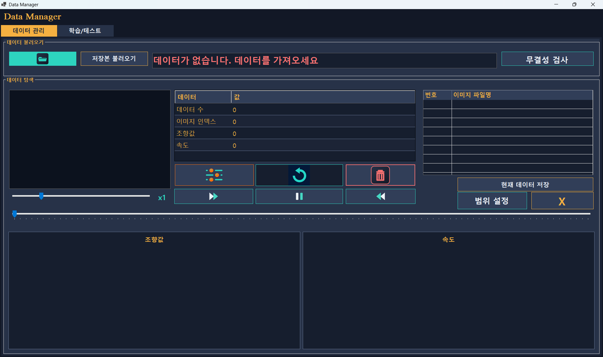
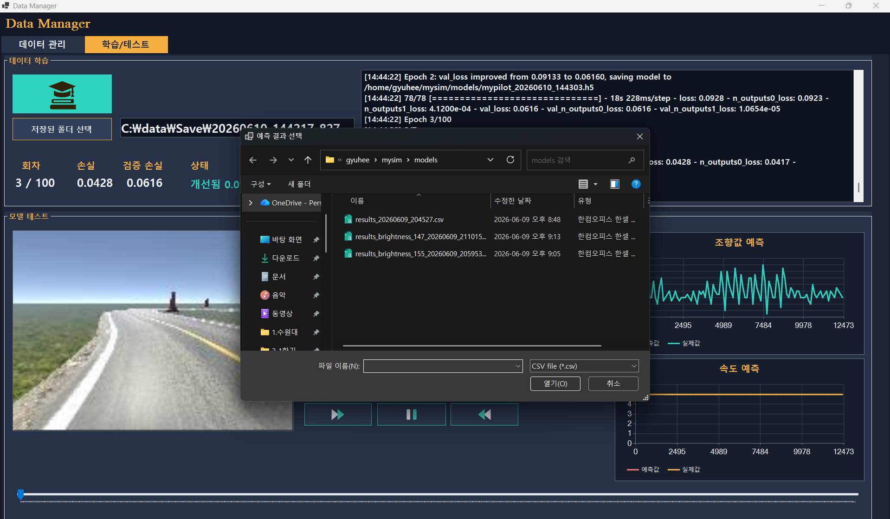
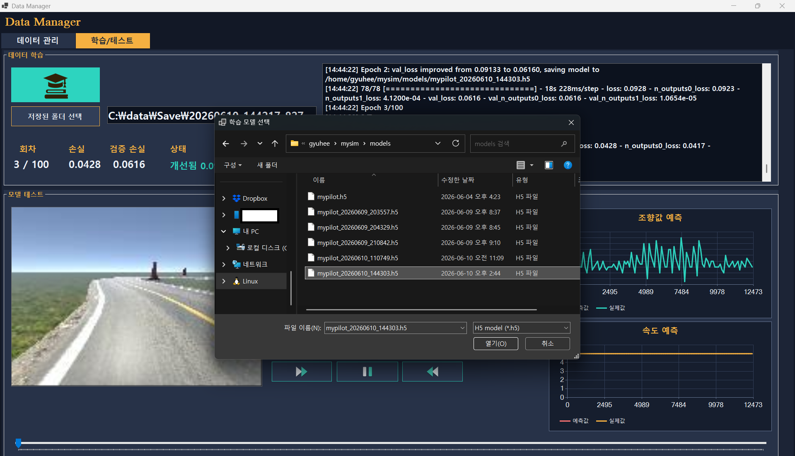
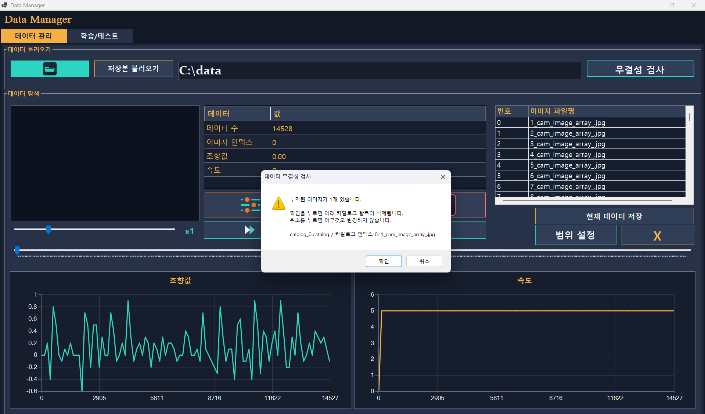
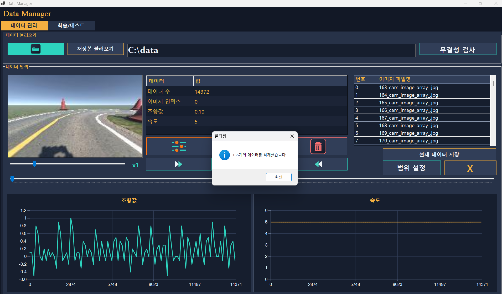
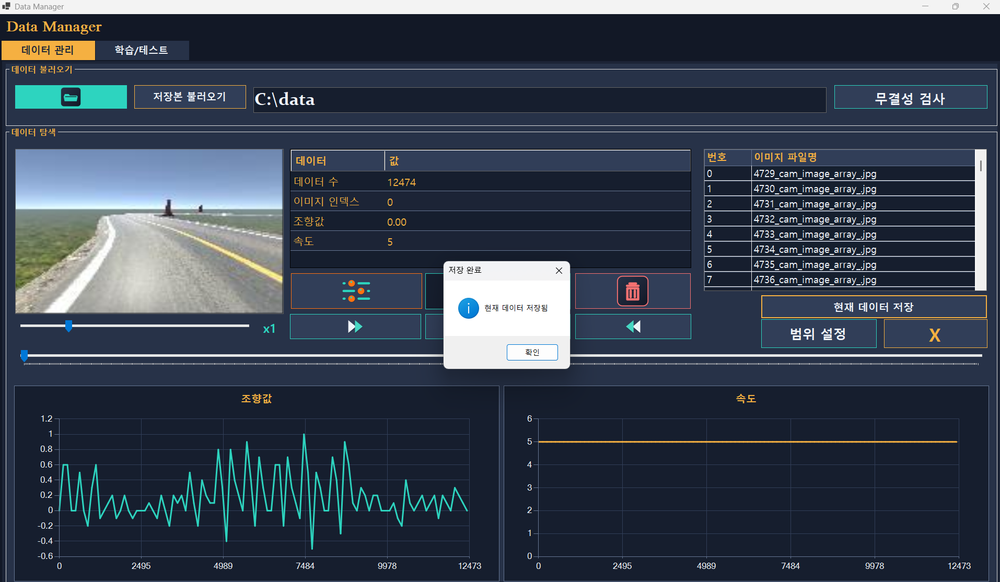
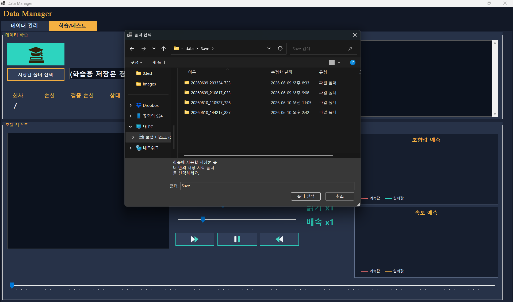
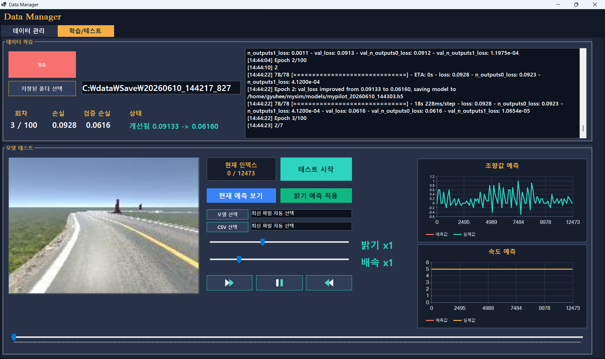
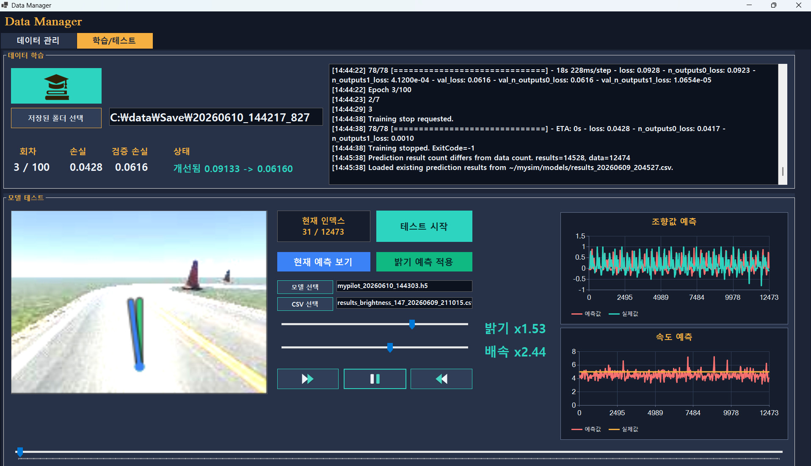

# Data Manager : Autonomous Driving Data Integrated Workflow


**Data Manager**는 Donkeycar 기반 자율주행 차량에서 수집한 주행 데이터를 WinForms GUI에서 불러오고, 검수하고, 정제하고, 저장본으로 분리한 뒤, WSL2 Python/TensorFlow 환경의 학습 및 추론 결과까지 연결해 확인할 수 있도록 만든 **자율주행 데이터 통합 관리 애플리케이션**입니다.

이 프로젝트의 핵심은 단순히 이미지를 보여주는 뷰어가 아니라, `Form1.cs` 안에서 데이터 관리 영역(`_allData`)과 학습/테스트 영역(`_trainingData`)을 분리해 운영한다는 점입니다. 1번 탭에서는 원본 또는 정제 대상 데이터를 탐색하고 삭제/필터링/저장하며, 2번 탭에서는 저장본을 별도로 불러와 학습 ZIP 생성, WSL 학습 실행, 모델 추론, 예측 CSV 로드, 오버레이 비교를 수행합니다.

---

## 프로젝트 개요

### 개발 배경

Donkeycar 주행 데이터는 이미지 프레임과 조향값, 스로틀값이 `.catalog` JSON 라인 파일에 함께 기록됩니다. 학습 전에 데이터 품질을 충분히 확인하지 않으면 다음과 같은 문제가 발생합니다.

* 카탈로그에는 기록되어 있지만 실제 이미지 파일이 없어 학습 도중 파일 경로 오류가 발생합니다.
* 정지 프레임이나 비정상 구간이 많이 포함되어 모델이 실제 주행 패턴보다 특정 상태에 치우쳐 학습합니다.
* 원본 데이터를 직접 수정하다가 필요한 프레임을 잃어버리거나, 어떤 정제본으로 학습했는지 추적하기 어려워집니다.
* Windows에서 관리하는 파일 경로와 WSL에서 실행되는 Python 경로 체계가 달라 학습/추론 스크립트가 파일을 찾지 못합니다.
* CSV 예측 결과만으로는 특정 프레임에서 AI가 어떤 조향/속도를 예측했는지 직관적으로 파악하기 어렵습니다.

Data Manager는 위 문제를 해결하기 위해 데이터 탐색, 무결성 검사, 삭제/복구, 저장본 생성, WSL 학습, 예측 결과 시각화를 하나의 GUI 흐름으로 묶었습니다.

### 전체 워크플로우

1. `데이터 관리` 탭에서 원본 Donkeycar 데이터 폴더 또는 기존 저장본을 선택합니다.
2. `.catalog` 파일을 논리 정렬(`StrCmpLogicalW`)한 뒤 JSON 라인을 읽어 `DrivingData` 리스트로 변환합니다.
3. 이미지 미리보기, 데이터 정보 표, 조향/속도 차트, 프레임 리스트를 이용해 데이터 상태를 확인합니다.
4. 무결성 검사로 누락 이미지 항목을 찾고, 필요하면 해당 카탈로그 항목을 삭제합니다.
5. 정지/저속성 데이터 필터링, 단일 프레임 삭제, 리스트 다중 선택 삭제, 마커 기반 범위 삭제로 데이터를 정제합니다.
6. 정제 결과를 `Save/yyyyMMdd_HHmmss_fff` 형태의 저장본 폴더로 생성합니다.
7. `학습/테스트` 탭에서 학습에 사용할 저장본 폴더를 선택해 `_trainingData`로 별도 로드합니다.
8. 선택된 저장본을 임시 ZIP으로 압축하고 WSL의 `~/mysim` 프로젝트로 전달해 `train.py` 학습을 실행합니다.
9. 생성된 H5 모델 또는 사용자가 선택한 H5 모델로 전체 프레임 예측을 실행합니다.
10. 예측 CSV를 `_trainingData`에 매핑하고, 차트와 이미지 오버레이에서 실제값과 예측값을 비교합니다.

---

## 프로젝트 팀 : 14조 (Team 14)

| 이름 | 학번 | 역할 | 핵심 구현 사항 |
| :--- | :--- | :--- | :--- |
| **황규희** | 25017095 | 팀장 / UI & 아키텍처 | WinForms 디자인 구현, 일부 기능 구현|
| **박주원** | 25017039 | 데이터 파이프라인 | 데이터 조사, 수집 |
| **홍시언** | 25017093 | 기능 고도화 & AI | 기능 구현, WinForms 디자인 일부 구현 |

> 위 역할 분담을 기준으로 개발하되, 구현량이 특정 영역에 집중될 때는 팀원이 서로 보조하는 방식으로 협업했습니다.

---

## 시스템 아키텍처 및 기술 스택

### 개발 및 테스트 환경

아래 버전은 이 프로젝트를 개발하고 기능을 확인한 기준 환경입니다. Windows GUI 애플리케이션은 Windows/.NET 환경에서 빌드하고, Donkeycar 학습 및 TensorFlow 추론은 WSL2 내부 conda 환경에서 실행했습니다.

| 구분 | 버전 / 값 | 확인 방법 또는 비고 |
| :--- | :--- | :--- |
| Windows | Microsoft Windows 11 Pro 10.0.26200, Build 26200, 64-bit | `Get-CimInstance Win32_OperatingSystem` |
| PowerShell | Windows PowerShell 5.1.26100.8457 | `$PSVersionTable.PSVersion` |
| .NET SDK | 10.0.300 | `dotnet --version`, `dotnet --list-sdks` |
| .NET Target Framework | `net10.0-windows` | `DataManager.csproj`의 `TargetFramework` |
| UI Framework | Windows Forms (`UseWindowsForms=true`) | `DataManager.csproj` |
| NuGet: Chart | `System.Windows.Forms.DataVisualization` 1.0.0-prerelease.20110.1 | `DataManager.csproj` |
| NuGet: SQL Client | `System.Data.SqlClient` 4.9.0 | `DataManager.csproj` |
| WSL | WSL2 | `wsl.exe -l -v` |
| Ubuntu 기준 | Ubuntu 24.04 LTS 호환 환경 | 코드의 `GetWslDistroArgument()`는 `Ubuntu-24.04`, `Ubuntu`, 기본 WSL 순서로 실행 대상을 찾습니다. |
| 현재 로컬 WSL 확인값 | Debian GNU/Linux 13 (trixie), `DEBIAN_VERSION_FULL=13.5` | 현재 PC의 기본 WSL 배포판은 `Debian`으로 확인되었습니다. |
| WSL 프로젝트 경로 | `~/mysim` | 학습, 모델 저장, CSV 결과 확인 기준 경로 |
| Conda | conda 24.4.0 | `~/miniconda3`, `e2e_env` 사용 |
| Conda 환경 | `e2e_env` | Donkeycar 학습 및 추론 실행 환경 |
| Python (WSL/AI) | Python 3.11.15 | `conda run -n e2e_env python --version` |
| Python (Windows) | Python 3.14.5 | `python --version`; WinForms 앱의 AI 실행은 WSL Python을 기준으로 합니다. |
| TensorFlow | 2.13.0 | `conda run -n e2e_env python -m pip show tensorflow` |
| DonkeyCar | 5.0.0 | `conda run -n e2e_env python -m pip show donkeycar` |
| NumPy | 1.24.3 | `conda run -n e2e_env python -m pip show numpy` |
| pandas | 2.0.3 | `conda run -n e2e_env python -m pip show pandas` |
| Pillow | 12.2.0 | `conda run -n e2e_env python -m pip show pillow` |

> 실행 대상 배포판은 코드에서 Ubuntu 계열을 먼저 찾도록 되어 있지만, 현재 확인된 로컬 WSL 등록 배포판은 Debian 13입니다. 따라서 README의 Ubuntu 24.04 표기는 호환 기준이고, 실제 재현 시에는 `wsl.exe -l -v`로 사용 중인 배포판 이름을 먼저 확인해야 합니다.

### Frontend / GUI

* **C# / .NET WinForms**
  * `Form1.cs`가 데이터 로드, 탐색, 전처리, 저장, 학습, 추론, 차트 갱신의 중심 역할을 담당합니다.
  * `Form1.Designer.cs`에는 `데이터 관리` 탭과 `학습/테스트` 탭의 컨트롤 배치와 이벤트 연결이 정의되어 있습니다.

* **GDI+ / System.Drawing**
  * 이미지 미리보기, 밝기 보정, 실제값/예측값 오버레이 렌더링에 사용합니다.
  * `ColorMatrix`로 테스트 이미지 밝기를 조정하고, `Graphics`와 `Pen`으로 조향/속도 방향 막대를 직접 그립니다.

* **MS Chart Controls**
  * 데이터 관리 탭에는 실제 조향값/속도 차트를 표시합니다.
  * 학습/테스트 탭에는 실제값(`Actual`)과 예측값(`Predict`)을 같은 축에서 비교하는 차트를 표시합니다.

### Backend / AI

* **Python 3**
  * WSL 내부에서 Donkeycar 학습 스크립트와 동적 생성 추론 스크립트를 실행합니다.

* **TensorFlow / Keras**
  * `tf.keras.models.load_model(...)`로 H5 모델을 불러와 이미지 배치 예측을 수행합니다.

* **Pillow / NumPy**
  * `predict_frames.py`에서 이미지를 `160x120` RGB로 변환하고, `0~1` 범위 배열로 정규화한 뒤 모델 입력으로 전달합니다.

### Environment / Interop

* **WSL2 Ubuntu**
  * `GetWslDistroArgument()`는 `Ubuntu-24.04`, `Ubuntu`, 기본 WSL 순서로 실행 대상을 선택합니다.
  * WSL 프로젝트 경로는 `~/mysim`, 모델/CSV 결과 폴더는 `models`로 관리합니다.

* **Conda 가상환경 (`e2e_env`)**
  * `BuildWslCondaCommand(...)`가 `~/miniconda3` 또는 `~/anaconda3`의 `conda.sh`를 찾아 환경을 활성화합니다.

* **System.Diagnostics.Process**
  * 학습, 테스트, WSL 명령, 파일 읽기, 경로 변환을 모두 비동기 서브프로세스로 실행합니다.

---

## 핵심 기능 및 화면 상세 가이드

이 섹션은 실제 `Form1.cs` 구현 흐름에 맞춰 각 화면이 어떤 데이터를 읽고, 어떤 컨트롤을 갱신하며, 어떤 내부 메서드로 이어지는지 자세히 설명합니다.

### 1. 통합 대시보드 인터페이스

`데이터 관리` 탭의 메인 화면은 원본 데이터 또는 정제 중인 데이터를 다루는 작업 공간입니다. 이 화면의 데이터 소스는 `_allData`이며, 학습/테스트 탭의 `_trainingData`와 분리되어 있습니다.



#### 화면 구성

* **상단 데이터 불러오기 영역**
  * `폴더 선택` 버튼으로 Donkeycar 데이터 폴더를 선택합니다.
  * `저장본 불러오기` 버튼으로 이전에 생성한 `Save/...` 저장본 폴더를 다시 열 수 있습니다.
  * `무결성 검사` 버튼은 현재 `_allData`에 매핑된 이미지 경로가 실제 파일로 존재하는지 검사합니다.
  * `txtFolderPath`는 선택된 폴더 경로를 보여주며, 데이터가 없을 때는 경고 색상으로 안내 문구를 표시합니다.

* **이미지 미리보기 영역**
  * `pbDataPreview`는 현재 `_currentIndex`에 해당하는 이미지 프레임을 보여줍니다.
  * 이미지는 `LoadImageWithoutLock(...)`을 통해 `File.ReadAllBytes`와 `MemoryStream` 기반으로 로드됩니다.
  * 이 방식은 `Image.FromFile()`처럼 원본 파일을 계속 점유하지 않기 때문에, 표시 중인 이미지도 삭제/정제 작업에 방해가 되지 않습니다.

* **데이터 정보 표**
  * `dgvDataInfo`에는 데이터 수, 이미지 인덱스, 조향값, 속도값이 표시됩니다.
  * `UpdateDisplay()`가 현재 프레임을 기준으로 값을 갱신합니다.
  * 조향값은 `F2`, 속도값은 `F0` 형식으로 표시되어 화면에서 빠르게 읽을 수 있습니다.

* **프레임 리스트**
  * `lvDataItems`는 `_allData`의 인덱스와 이미지 파일명을 표시합니다.
  * `MultiSelect`가 켜져 있어 여러 프레임을 선택한 뒤 한 번에 삭제할 수 있습니다.
  * 마우스 드래그 선택을 위한 앵커 인덱스(`_listViewDragAnchorIndex`)도 별도로 관리합니다.

* **조향/속도 차트**
  * `chtSteeringValue`는 실제 조향값을, `chtSpeedValue`는 실제 속도값을 표시합니다.
  * `UpdateCharts()`는 데이터가 많을 때 전체를 모두 찍지 않고 `_allData.Count / 100` 기준으로 샘플링해 성능을 유지합니다.

#### 데이터 로드 흐름

1. 사용자가 폴더를 선택하면 `LoadData(path)`가 실행됩니다.
2. `_selectedDataFolderPath`에 경로를 저장하고, `_allData`, Undo 스택, 범위 마커, 리스트뷰, 기존 미리보기 이미지를 초기화합니다.
3. 선택 폴더에서 `*.catalog` 파일을 찾고, `ResolveImageBasePath(path)`로 실제 `images` 폴더 기준 경로를 계산합니다.
4. `ParseCatalogData` 메소드가 각 catalog JSON 라인을 읽어 `DrivingData` 객체를 만듭니다.
5. 각 데이터는 `Index`, `ImagePath`, `Steering`, `Speed`, `CatalogRawLine`, `CatalogFilePath`, `CatalogImageName`, `CatalogLineNumber`를 보존합니다.
6. 로드 후 `ReindexDataItems()`, `UpdateDisplay()`, `UpdateCharts()`를 호출해 화면과 차트를 맞춥니다.

#### 탐색 및 재생 흐름

* `tbImageNavigator`를 움직이면 `_currentIndex`가 변경되고 `UpdateDisplay()`가 호출됩니다.
* 재생 버튼은 `_isReversed = false`로 설정한 뒤 `_playTimer`를 시작합니다.
* 역재생 버튼은 `_isReversed = true`로 설정한 뒤 같은 타이머를 반대 방향으로 움직입니다.
* 정지 버튼은 `_playTimer.Stop()`으로 현재 위치에서 재생을 멈춥니다.
* 재생 속도는 `tbPlaybackSpeed` 값으로 계산되며, 기본 간격 `BasePlaybackIntervalMs = 50`을 기준으로 속도 배율에 따라 타이머 간격이 조정됩니다.

#### 구현상 특징

* 데이터 관리 탭은 `_allData`만 수정합니다.
* 저장본을 만들기 전까지 원본 폴더의 catalog를 바로 덮어쓰지 않습니다.
* 이미지 표시 전에 기존 `PictureBox.Image`를 `Dispose()`해 장시간 탐색 중 메모리 누수를 줄입니다.
* 창 크기 변경 시 `ApplyResponsiveLayout()`, `EnsureDataChartsLayout()`이 호출되어 차트와 주요 패널 위치를 다시 잡습니다.

### 2. 초기 대기 상태 및 리소스 관리

프로그램 실행 직후 또는 데이터가 없는 상태에서는 무거운 데이터 객체를 만들지 않고, 사용자가 폴더를 선택할 때까지 대기합니다.



#### 초기화 동작

* 생성자에서는 UI 컨트롤 기본값을 먼저 세팅합니다.
* `tbPlaybackSpeed`와 `tbTestPlaybackSpeed`는 `25~400` 범위로 설정되어 `x0.25~x4.00` 배속을 표현합니다.
* `tbTestBrightness`는 `40~200` 범위로 설정되어 `x0.40~x2.00` 밝기 계수를 표현합니다.
* `_uiContext = SynchronizationContext.Current`로 UI 스레드 컨텍스트를 저장해 비동기 로그 갱신에 활용합니다.
* `_playTimer`와 `_testPlayTimer`는 서로 다른 타이머로 등록되어 탭 간 재생 상태가 섞이지 않습니다.

#### 데이터 없음 처리

* `_allData`가 비어 있으면 `EnsureDataLoaded()`가 `ShowNoDataMessage()`를 호출합니다.
* 이때 데이터 관리 탭의 재생 타이머를 멈추고, 폴더 경로 텍스트박스에 `데이터가 없습니다. 데이터를 가져오세요` 안내를 표시합니다.
* `_trainingData`가 비어 있으면 `EnsureTrainingDataLoaded()`가 `ShowNoTrainingDataMessage()`를 호출합니다.
* 학습/테스트 탭에서는 테스트 재생 타이머를 멈추고, 테스트 미리보기 이미지를 해제하며, 현재 인덱스 라벨을 초기화합니다.

#### 리소스 관리

* `ReleaseDataPreviewImage()`는 데이터 관리 탭 미리보기 이미지를 해제합니다.
* `ReleaseTestPreviewImage()`는 학습/테스트 탭 미리보기 이미지를 해제합니다.
* `ReleasePreviewImages()`는 두 탭의 이미지를 모두 해제합니다.
* `Form1_FormClosed` 흐름에서는 앱 종료 시 WSL 관련 정리도 수행할 수 있도록 구성되어 있습니다.

### 3. 멀티 포맷 데이터 및 모델 동적 로드

이 프로젝트에서 “로드”는 세 가지 의미를 가집니다. 첫째는 Donkeycar `.catalog` 주행 데이터 로드, 둘째는 학습/테스트용 저장본 로드, 셋째는 WSL `models` 폴더의 H5 모델 및 CSV 예측 결과 로드입니다.

#### CSV 데이터 고속 로드



##### Donkeycar catalog 로드

* `ParseCatalogData(...)`는 `*.catalog` 파일을 `StrCmpLogicalW`로 논리 정렬합니다.
* 각 줄을 `JsonDocument.Parse(line)`으로 읽고 다음 값을 추출합니다.
  * `cam/image_array`: 이미지 파일명
  * `user/angle`: 조향값
  * `user/throttle`: 스로틀값
* 이미지 경로는 `Path.Combine(basePath, "images", imgName)`으로 구성합니다.
* 속도값은 화면 표시와 차트 비교를 위해 `throttle * 100`으로 저장합니다.
* JSON 파싱 실패 라인은 전체 로드를 중단하지 않고 건너뛰도록 처리되어 있습니다.

##### 예측 CSV 로드

* `CSV 선택` 버튼은 `SelectArtifactFileAsync(...)`를 통해 WSL `~/mysim/models` 폴더에 접근할 수 있는 Windows 경로를 열어줍니다.
* 사용자가 CSV를 직접 선택하지 않으면 `ResolvePredictionResultsFileAsync()`가 `models/*.csv` 중 최신 파일을 자동 선택합니다.
* `현재 예측 보기`는 선택된 CSV 또는 최신 CSV를 WSL에서 `cat`으로 읽어 `LoadPredictionResults(...)`에 넘깁니다.
* CSV 한 줄은 `angle,throttle` 형식으로 파싱되고, `_trainingData[i]`의 `PredictedSteering`, `PredictedSpeed`, `HasPrediction`에 매핑됩니다.
* CSV 줄 수와 `_trainingData.Count`가 다르면 로그에 차이를 남기고, 가능한 범위까지만 매핑합니다.

#### H5 추론 모델 즉시 적용



##### 모델 선택 방식

* `모델 선택` 버튼은 H5 파일(`*.h5`)을 선택합니다.
* 선택된 파일명은 `NormalizeSelectedArtifactPath(...)`를 통해 `models/<fileName>` 형태의 WSL 프로젝트 상대 경로로 정규화됩니다.
* 모델을 직접 선택하지 않으면 `ResolveModelFileForPredictionAsync()`가 WSL `models/*.h5` 중 가장 최신 파일을 자동으로 찾습니다.
* 현재 선택된 모델명은 `txtSelectedModelFile`에 표시되며, 없을 때는 `최신 파일 자동 선택`으로 표시됩니다.

##### 동적 추론 스크립트 생성

* `테스트 시작` 또는 `밝기 예측 적용`을 누르면 `btnStartTest_Click(...)` 흐름이 실행됩니다.
* WinForms는 현재 `_trainingData` 이미지 목록을 WSL 경로로 변환해 `win_paths.txt`에 씁니다.
* 이후 `predict_frames.py`를 앱 실행 폴더에 동적으로 생성합니다.
* 생성되는 Python 스크립트는 다음 작업을 수행합니다.
  * TensorFlow로 H5 모델을 로드합니다.
  * `win_paths.txt`에서 이미지 경로 목록을 읽습니다.
  * 각 이미지를 RGB, `160x120`, `0~1` 배열로 전처리합니다.
  * 밝기 계수가 `1.0`이 아니면 `np.clip(image_array * brightness_factor, 0.0, 1.0)`로 입력 밝기를 조정합니다.
  * 1024장 단위 배치로 모델 예측을 수행합니다.
  * 예측 결과를 `models/results_yyyyMMdd_HHmmss.csv` 또는 `models/results_brightness_XXX_yyyyMMdd_HHmmss.csv`로 저장합니다.
* 예측된 프레임 수가 0이면 오류를 발생시키고, 누락 경로 예시를 로그에 포함해 원인 파악을 돕습니다.

### 4. 데이터 무결성 검증 및 전처리 시스템

데이터 관리 탭의 정제 기능은 `_allData`에만 적용됩니다. 학습/테스트 탭의 `_trainingData`는 별도로 저장본을 선택했을 때 로드되므로, 원본 검수와 학습 검증 흐름이 분리됩니다.

#### 데이터 무결성 검사



##### 검사 대상

* `btnCheckDataIntegrity_Click(...)`는 현재 `_allData`의 `ImagePath`를 기준으로 `File.Exists(...)`를 검사합니다.
* 누락 이미지가 없으면 `검사 완료 / 누락된 이미지가 없습니다.` 메시지를 표시합니다.
* 누락 이미지가 있으면 최대 40개까지 다음 정보를 보여줍니다.
  * catalog 파일명
  * catalog 라인 번호
  * catalog에 기록된 이미지 파일명

##### 삭제 연동

* 누락 항목이 발견되면 사용자는 `확인` 또는 `취소`를 선택할 수 있습니다.
* `확인`을 누르면 누락 이미지에 해당하는 `DrivingData` 항목들이 `DeleteDataItems(...)`로 넘어갑니다.
* 삭제 전 복구 위치는 누락 항목 중 가장 앞 인덱스로 계산됩니다.
* 삭제도 일반 삭제와 동일하게 Undo 스택에 쌓이므로, 실수로 지워도 `btnCancelDelete_Click(...)` 흐름으로 되돌릴 수 있습니다.

##### 구현상 의미

* 실제 이미지 파일을 삭제하는 기능이 아니라, 학습/저장본 생성에서 제외할 catalog 항목을 `_allData`에서 제거하는 기능입니다.
* 이후 `현재 데이터 저장`을 누르면 제거된 항목이 빠진 catalog 저장본이 새로 생성됩니다.

#### 스마트 노이즈 필터링



##### 필터링 기준

* `btnFilter_Click(...)`는 `_allData.Where(x => x.Steering == 0 || x.Speed == 0)` 조건으로 대상을 찾습니다.
* 즉 조향값이 0이거나 속도값이 0인 프레임을 정제 대상으로 봅니다.
* 대상이 없으면 `삭제할 데이터가 없습니다.` 메시지를 표시합니다.

##### 삭제 처리

* 필터링 대상이 있으면 첫 대상의 위치를 복구 인덱스로 잡고 `DeleteDataItems(targets, restoreIndex)`를 호출합니다.
* 삭제된 항목들은 `_deleteUndoStack`에 `DeleteAction`으로 저장됩니다.
* 삭제 후 `_allData`에서 항목을 제거하고, `ReindexDataItems()`로 인덱스를 다시 부여합니다.
* `RefreshUI()`가 리스트, 미리보기, 차트, 트랙바 범위를 한 번에 갱신합니다.

##### 학습 품질 측면

* 스로틀이 0인 정지 프레임이 많으면 모델이 움직임보다 정지 상태를 더 강하게 학습할 수 있습니다.
* 조향값이 0인 직진 또는 무조작성 프레임이 과도하면 코너링 대응 학습 비중이 낮아질 수 있습니다.
* 이 필터는 완전 자동 정답이라기보다, 학습 전에 빠르게 후보를 걷어내는 1차 정제 도구로 설계되어 있습니다.

#### 마커 기반 구간 정밀 삭제


##### 범위 지정 방식

* `범위 설정` 버튼을 누르면 `_isRangeSettingMode = true`가 됩니다.
* 이후 이미지 탐색 트랙바에서 위치를 정하고 마우스를 놓으면 `AddMarker()`가 현재 `_currentIndex` 위치에 마커 패널을 추가합니다.
* 마커는 최대 2개까지만 유지되며, 3번째 마커가 생기면 가장 오래된 마커를 제거합니다.
* 마커 위치는 트랙바의 현재 값과 전체 범위를 비율로 계산해 표시됩니다.

##### 삭제 우선순위

`btnDelete_Click(...)`는 삭제 대상을 다음 순서로 결정합니다.

1. 마커가 2개 있으면 두 마커 사이의 연속 구간을 삭제합니다.
2. 마커가 없고 리스트뷰 선택 항목이 있으면 선택된 여러 항목을 삭제합니다.
3. 둘 다 없으면 현재 `_currentIndex`의 단일 프레임을 삭제합니다.

##### 삭제 후 처리

* 구간 삭제는 `_allData.GetRange(min, max - min + 1)`로 대상 리스트를 얻습니다.
* 삭제 후 `ClearMarkers()`로 화면 마커와 범위 설정 상태를 초기화합니다.
* 삭제된 데이터는 Undo 스택에 보관되므로 바로 복구할 수 있습니다.

### 5. 상태 저장 및 스택 기반 안전 복구 로직

이 프로젝트는 원본 데이터를 즉시 덮어쓰기보다, 정제된 catalog 상태를 별도의 저장본으로 만드는 흐름을 사용합니다.

#### 데이터 영속성 저장



##### 저장본 생성 위치

* `현재 데이터 저장` 버튼은 `btnSaveCatalogState_Click(...)`를 실행합니다.
* `CreateCatalogSaveDirectory(...)`는 원본 데이터 루트 아래에 `Save` 폴더를 만들고, 그 안에 `yyyyMMdd_HHmmss_fff` 형식의 저장 시각 폴더를 생성합니다.
* 저장본 경로 예시는 다음과 같습니다.

```text
원본데이터/
├─ images/
├─ catalog_0.catalog
├─ manifest.json
└─ Save/
   └─ 20260610_231540_123/
      ├─ catalog_0.catalog
      ├─ catalog_0.catalog_manifest
      ├─ manifest.json
      └─ metadata.json
```

##### catalog 재작성 방식

* `WriteSavedCatalogFiles(saveDir)`는 현재 `_allData`에 남아 있는 항목을 원본 `CatalogFilePath` 기준으로 그룹화합니다.
* 각 원본 catalog 파일마다 같은 이름의 target catalog를 저장본 폴더에 만듭니다.
* 삭제되지 않고 남아 있는 `CatalogRawLine`만 골라 새 catalog 파일에 씁니다.
* 즉 이미지 파일 전체를 복제하는 방식이 아니라, 학습에 사용할 catalog 상태를 저장본으로 분리하는 방식입니다.

##### manifest 처리

* 각 catalog의 `_manifest` 파일은 `WriteCatalogManifestFile(...)`에서 다시 작성됩니다.
* 원본 manifest가 있으면 `created_at`, `path`, `start_index`를 최대한 보존합니다.
* `line_lengths`는 새로 저장된 catalog 라인의 길이를 기준으로 다시 계산합니다.
* `manifest.json`, `metadata.json`은 `CopyTubMetadataFiles(...)`에서 데이터 루트 또는 선택 폴더 기준으로 찾아 저장본에 복사합니다.

#### 이중 롤백(Undo) 시스템



##### 메모리 Undo

* 삭제, 필터링, 무결성 검사 삭제는 모두 `DeleteDataItems(...)`를 거칩니다.
* 삭제 전 `DeleteAction` 객체에 삭제 대상 목록과 복구 위치를 저장합니다.
* 이 객체는 `_deleteUndoStack`에 push됩니다.
* `btnCancelDelete_Click(...)`는 스택에서 마지막 삭제 작업을 pop한 뒤, 원래 위치에 `InsertRange(...)`로 데이터를 되돌립니다.
* 복구 후 `ReindexDataItems()`와 `RefreshUI()`를 호출해 리스트, 차트, 이미지 상태를 다시 맞춥니다.

##### 저장본 불러오기

* `저장본 불러오기`는 선택한 저장본 폴더를 다시 `LoadData(...)`로 읽어 `_allData`에 로드합니다.
* 저장본 폴더가 `Save/<timestamp>` 구조인 경우 `ResolveDataRootPath(...)`가 원본 루트를 찾아 `images` 경로를 올바르게 연결합니다.
* 이 구조 덕분에 저장본 catalog는 가볍게 유지하면서도 원본 이미지 폴더를 계속 참조할 수 있습니다.

##### 학습용 저장본 선택

* 학습/테스트 탭의 `저장된 폴더 선택`은 `btnSelectTrainingSave_Click(...)`를 통해 저장본 폴더를 선택합니다.
* 선택된 경로는 `_selectedTrainingSavePath`에 저장되고, `LoadTrainingData(path)`가 `_trainingData`를 새로 채웁니다.
* 이때 데이터 관리 탭의 `_allData`와 학습/테스트 탭의 `_trainingData`가 분리되어 있으므로, 1번 탭에서 다른 폴더를 열어도 2번 탭의 테스트 프레임이 따라 바뀌지 않습니다.

### 6. 비동기 AI 파이프라인 및 학습 환경 연동

`학습/테스트` 탭은 저장본 기반 `_trainingData`를 대상으로 동작합니다. 학습 입력 압축, WSL 환경 실행, 모델 파일 선택, 예측 결과 로드, 밝기 기반 추론을 한 화면에서 수행합니다.

#### 논블로킹 AI 모델 학습



##### 학습 데이터 준비

* 사용자가 `저장된 폴더 선택`으로 학습 폴더를 선택하면 `_trainingData`가 채워지고 테스트 미리보기가 첫 프레임으로 갱신됩니다.
* `btnTrain_Click(...)`는 `_trainingData`가 비어 있으면 실행하지 않습니다.
* 학습 시작 시 `CreateTrainingDataZip()`이 선택된 학습 catalog 폴더를 임시 ZIP 파일로 압축합니다.
* ZIP에는 다음 파일이 들어갑니다.
  * 비어 있지 않은 `*.catalog`
  * 각 catalog의 `_manifest`
  * `manifest.json`, `metadata.json`
  * `images/` 하위 전체 이미지 파일
* `BuildTrainingManifestText(...)`는 학습에 포함되는 catalog 목록 기준으로 manifest 내용을 보정합니다.

##### WSL 학습 실행

* ZIP 파일 경로는 `ConvertWindowsPathToWslPath(...)`로 `/mnt/<drive>/...` 형태로 변환됩니다.
* WSL에서는 `~/mysim` 경로로 이동한 뒤 기존 `./data`를 지우고 새 ZIP을 `./training_data.zip`으로 복사합니다.
* `python -m zipfile -e ./training_data.zip ./data`로 압축을 해제하고, `./data/images` 및 `./data/*.catalog` 존재 여부를 확인합니다.
* 이후 필요한 패키지를 설치하고 `python train.py --tubs ./data --model models/mypilot_yyyyMMdd_HHmmss.h5`를 실행합니다.

##### 비동기 로그 및 중지 처리

* 학습 프로세스는 `Process`로 실행되며 stdout/stderr를 모두 리다이렉트합니다.
* `OutputDataReceived`, `ErrorDataReceived` 이벤트에서 들어온 로그는 `AppendTrainingLog(...)`로 화면에 추가됩니다.
* `UpdateTrainingSummaryFromLog(...)`는 학습 로그에서 epoch/loss/val_loss/status 정보를 찾아 요약 라벨에 반영합니다.
* 학습 중 같은 버튼을 다시 누르면 `_isTrainingRunning` 상태를 보고 `StopTrainingProcess()`를 호출해 실행 중인 프로세스를 중지합니다.
* 프로세스 대기는 `await process.WaitForExitAsync()`로 처리되어 UI가 멈추지 않습니다.

#### 조도(Brightness) 편차 강건성 검증



##### 테스트 화면 구성

* `pbTestPreview`는 `_trainingData`의 현재 프레임을 보여줍니다.
* `tbTestImageNavigator`는 테스트용 프레임 인덱스를 이동합니다.
* `btnTestPlay`, `btnTestReverse`, `btnTestStop`은 `_testPlayTimer`와 `_testCurrentIndex`를 이용해 학습/테스트 탭 안에서만 재생됩니다.
* `tbTestBrightness`는 `x0.40~x2.00` 범위의 밝기 계수를 조절합니다.
* `lblTestBrightness`는 현재 밝기 배율을 표시하고, 슬라이더가 움직이면 `ShowFrame(_testCurrentIndex)`가 다시 호출됩니다.

##### 밝기 보정 미리보기

* `ShowFrame(index)`는 `_trainingData[index]`의 이미지를 읽어옵니다.
* `CreateBrightnessAdjustedBitmap(originalImage, GetTestBrightnessFactor())`가 `ColorMatrix`로 RGB 채널에 밝기 계수를 곱합니다.
* 이 밝기 보정은 테스트 미리보기 화면에 즉시 반영됩니다.
* 예측 오버레이가 켜져 있으면 같은 이미지 위에 실제값/예측값 막대도 함께 그립니다.

##### 전체 프레임 예측

* `테스트 시작`은 선택 모델 또는 최신 H5 모델을 사용해 현재 `_trainingData` 전체에 대한 예측을 실행합니다.
* `밝기 예측 적용`도 내부적으로 같은 전체 예측 흐름을 사용하되, 현재 밝기 배율을 명확히 로그에 남기고 해당 버튼을 실행 버튼으로 표시합니다.
* 기본 밝기 `x1.00`이면 결과 파일 접두사는 `results`입니다.
* 기본이 아닌 밝기라면 `results_brightness_040`, `results_brightness_125`, `results_brightness_200`처럼 밝기 토큰이 포함된 CSV가 생성됩니다.
* 이 구조로 원본 밝기 예측 결과와 밝기 변화 입력 예측 결과를 파일명 단계에서 구분할 수 있습니다.

##### 예측 결과 반영

* 예측이 끝나면 WSL에서 결과 CSV를 읽고 `LoadPredictionResults(...)`가 `_trainingData`에 값을 매핑합니다.
* `PredictedSpeed`는 CSV throttle에 `100`을 곱해 실제 속도 표시 스케일과 맞춥니다.
* 파싱된 예측이 하나라도 있으면 `_showTestOverlay = true`가 되어 차트와 이미지 오버레이가 예측값을 표시합니다.
* 모든 예측값이 `0,0`이면 로그에 경고를 남겨 이미지 경로 실패나 모델 출력 문제를 의심할 수 있게 합니다.

##### 오버레이 렌더링

* `DrawControlBars(...)`는 이미지 하단 중앙을 원점으로 잡고 실제값과 예측값을 선으로 그립니다.
* 실제값은 초록 계열, 예측값은 파란 계열로 표시합니다.
* 조향값은 `-1.0~1.0` 범위로 clamp한 뒤 좌우 각도로 변환합니다.
* throttle은 `0.0~1.0` 범위로 정규화하고, 값이 `1`보다 크면 `100` 스케일로 들어온 값으로 보고 나눠서 처리합니다.
* 선 길이는 throttle에 비례하고, 선 방향은 steering에 비례하므로 특정 프레임에서 모델이 얼마나 틀어졌는지 바로 확인할 수 있습니다.

##### 테스트 차트

* `chtTestSteeringValue`는 실제 조향값과 예측 조향값을 함께 표시합니다.
`chtTestSpeedValue`는 실제 스로틀(출력) 값과 예측 스로틀 값을 함께 표시합니다.
* 예측 오버레이가 켜진 상태에서는 `_trainingData.Count / 500` 기준으로 더 촘촘히 샘플링하고, 예측 전에는 `/100` 기준으로 가볍게 표시합니다.
* 차트 숫자 표시에서는 near-zero 값이 `-0`으로 보이지 않도록 `Chart_FormatNumber(...)`에서 정리합니다.

---

## 주요 구현 포인트

### 1. `_allData`와 `_trainingData` 분리

`Form1.cs`는 두 개의 주 데이터 리스트를 사용합니다.

* `_allData`: 데이터 관리 탭에서 로드, 탐색, 삭제, 필터링, 저장하는 데이터
* `_trainingData`: 학습/테스트 탭에서 저장본 선택, 학습 ZIP 생성, 테스트 미리보기, 예측 CSV 매핑, 오버레이 차트에 사용하는 데이터

이 분리 덕분에 데이터 관리 탭에서 다른 폴더를 새로 불러와도 학습/테스트 탭의 미리보기와 예측 결과가 섞이지 않습니다.

### 2. catalog 원본 라인 보존

`DrivingData`는 단순 화면 표시용 값만 들고 있지 않습니다. 원본 catalog 라인(`CatalogRawLine`), 원본 catalog 파일 경로(`CatalogFilePath`), 이미지 파일명(`CatalogImageName`), 라인 번호(`CatalogLineNumber`)를 함께 저장합니다.

정제 후 저장본을 만들 때는 현재 살아남은 `DrivingData`의 `CatalogRawLine`만 다시 써서 catalog 파일을 구성합니다. 그래서 JSON을 새로 조립하다가 Donkeycar가 기대하는 필드가 빠지는 위험을 줄입니다.

### 3. 파일 잠금 없는 이미지 로딩

이미지를 `PictureBox`에 직접 파일 핸들로 물리지 않고, 바이트 배열과 메모리 스트림을 거쳐 `Bitmap`으로 복사합니다. 이후 화면 전환 때 기존 이미지를 명시적으로 해제합니다.

이 방식은 이미지 파일을 보면서 동시에 삭제/필터링/저장본 생성을 해야 하는 데이터 정제 앱에 특히 중요합니다.

### 4. WSL 경로 변환 전략

학습 ZIP처럼 Windows 임시 폴더에 생성되는 파일은 `ConvertWindowsPathToWslPath(...)`로 `/mnt/c/...` 형태로 변환합니다.

테스트 이미지 경로는 `ConvertImagePathToWslPath(...)`가 담당합니다. 여기서는 `\\wsl.localhost\...`, `\\wsl$\...` 형태와 일반 드라이브 경로를 나누어 처리하고, WSL 홈 경로가 `/mnt/w/home/...`처럼 잘못 변환되지 않도록 보정합니다.

### 5. 자동 최신 산출물 선택

모델 또는 CSV 파일을 직접 선택하지 않아도 `GetLatestWslArtifactAsync(...)`가 WSL `~/mysim/models` 아래에서 최신 `*.h5` 또는 `*.csv`를 찾습니다.

따라서 사용자는 방금 학습한 모델을 바로 테스트하거나, 방금 생성한 예측 CSV를 다시 불러오는 흐름을 자연스럽게 사용할 수 있습니다.

### 6. UI 프리징 방지

학습과 테스트는 모두 `Process`를 사용하지만, 종료 대기는 `WaitForExitAsync()`로 처리합니다. stdout/stderr는 비동기 이벤트로 수집하고, UI 갱신은 저장해 둔 `SynchronizationContext`를 통해 메인 스레드로 넘깁니다.

이 구조 덕분에 TensorFlow 모델 로딩이나 대량 이미지 예측처럼 오래 걸리는 작업 중에도 WinForms 창이 굳지 않습니다.

---

## 트러블슈팅 및 극복 과정

### 1. Cross-Thread UI 업데이트 예외

* **문제 상황**
  * WSL Python 프로세스의 stdout/stderr 이벤트는 백그라운드 스레드에서 발생합니다.
  * 이 이벤트에서 WinForms 라벨이나 로그 박스를 직접 수정하면 Cross-thread 예외가 발생할 수 있습니다.

* **해결 방법**
  * 폼 생성 시점에 `_uiContext = SynchronizationContext.Current`를 저장했습니다.
  * 로그 갱신은 `AppendTrainingLog(...)`를 통해 UI 스레드로 안전하게 위임하도록 구성했습니다.

### 2. 이미지 파일 점유로 인한 삭제 실패

* **문제 상황**
  * `Image.FromFile()` 기반 로딩은 표시 중인 파일을 잠글 수 있습니다.
  * 데이터 정제 앱에서는 현재 보고 있는 이미지도 삭제 또는 저장본 제외 대상이 될 수 있어 파일 잠금이 치명적입니다.

* **해결 방법**
  * `LoadImageWithoutLock(...)`에서 `File.ReadAllBytes`와 `MemoryStream`을 사용해 이미지를 복사본으로 로드했습니다.
  * `ReleaseDataPreviewImage()`, `ReleaseTestPreviewImage()`에서 이전 이미지를 해제해 메모리 누수도 방지했습니다.

### 3. Windows와 WSL 경로 불일치

* **문제 상황**
  * WinForms는 `C:\...` 경로를 사용하지만 WSL Python은 `/mnt/c/...` 또는 `/home/...` 경로를 사용합니다.
  * 경로 변환이 틀리면 학습 ZIP, 모델 파일, 이미지 파일, 예측 CSV를 찾지 못합니다.

* **해결 방법**
  * 학습 ZIP은 드라이브 문자 기반 WSL 경로로 변환했습니다.
  * 이미지 경로는 WSL 네트워크 경로와 일반 Windows 경로를 분기 처리했습니다.
  * 앱 실행 폴더는 `wslpath`를 호출해 WSL에서 인식 가능한 경로로 얻은 뒤 `predict_frames.py`와 `win_paths.txt` 경로를 구성했습니다.

### 4. 외부 프로세스 대기로 인한 UI 프리징

* **문제 상황**
  * 학습, 패키지 설치, TensorFlow 모델 로딩, 대량 프레임 예측은 오래 걸립니다.
  * 동기 대기를 사용하면 WinForms 메인 스레드가 막혀 창이 응답 없음 상태가 됩니다.

* **해결 방법**
  * 학습과 테스트 이벤트 핸들러를 비동기 흐름으로 구성했습니다.
  * `await process.WaitForExitAsync()`를 사용해 UI 스레드를 막지 않도록 했습니다.
  * 실행 중 버튼을 다시 누르면 해당 프로세스를 중지할 수 있도록 `_isTrainingRunning`, `_isTestRunning` 상태를 관리합니다.

### 5. 예측 결과가 모두 0으로 보이는 문제

* **문제 상황**
  * 이미지 경로가 잘못되면 실제 예측이 수행되지 않았는데도 CSV가 `0,0`으로 채워진 것처럼 보일 수 있습니다.

* **해결 방법**
  * 동적 생성 Python 스크립트에서 실제 예측된 이미지 수(`predicted_count`)를 셉니다.
  * 전체 이미지가 있는데 예측 수가 0이면 예외를 발생시키고, 누락 경로 예시를 로그에 표시합니다.
  * CSV 로드 후에도 모든 파싱 결과가 `0,0`이면 WinForms 로그에 경고를 남깁니다.

### 6. 차트 축 라벨의 `-0` 표시

* **문제 상황**
  * 실제 값이 아주 작은 음수일 때 차트 축 라벨이 `-0`으로 표시되어 사용자가 데이터 이상으로 오해할 수 있습니다.

* **해결 방법**
  * 실제 데이터나 예측값을 바꾸지 않고, `Chart_FormatNumber(...)`에서 표시용 숫자만 보정했습니다.
  * 원본 의미는 보존하면서 UI 표시만 자연스럽게 정리했습니다.

---

## 실행 및 사용 순서

### 1. 데이터 불러오기

1. `데이터 관리` 탭에서 `폴더 선택` 또는 `저장본 불러오기`를 누릅니다.
2. 선택 폴더 안의 `*.catalog` 파일이 `_allData`로 로드됩니다.
3. 이미지 미리보기, 데이터 정보 표, 리스트뷰, 조향/속도 차트가 갱신됩니다.
4. `무결성 검사`를 눌러 누락 이미지 항목을 확인합니다.

### 2. 데이터 정제

1. 재생/역재생/트랙바로 문제 구간을 찾습니다.
2. `필터링` 버튼으로 조향값 또는 스로틀 값이 0인 후보 프레임을 제거합니다.
3. `범위 설정`으로 마커 2개를 찍은 뒤 삭제 버튼으로 연속 구간을 제거합니다.
4. 리스트뷰에서 여러 항목을 선택한 뒤 삭제할 수도 있습니다.
5. 실수로 삭제한 경우 Undo 버튼으로 직전 삭제 작업을 복구합니다.

### 3. 저장본 생성

1. 정제가 끝나면 `현재 데이터 저장`을 누릅니다.
2. 원본 데이터 루트 아래 `Save/<timestamp>` 폴더가 생성됩니다.
3. 현재 `_allData`에 남은 catalog 라인과 manifest/metadata가 저장본으로 기록됩니다.

### 4. 학습 데이터 선택

1. `학습/테스트` 탭으로 이동합니다.
2. `저장된 폴더 선택`으로 학습에 사용할 저장본 폴더를 선택합니다.
3. 선택된 데이터가 `_trainingData`로 로드되고 테스트 미리보기가 갱신됩니다.

### 5. 모델 학습

1. 학습 버튼을 누르면 선택 저장본이 임시 ZIP으로 압축됩니다.
2. WSL `~/mysim`의 `./data` 폴더가 새 학습 데이터로 교체됩니다.
3. `e2e_env` Conda 환경에서 `train.py`가 실행됩니다.
4. 학습 로그, epoch, loss, validation loss, 상태가 GUI에 표시됩니다.
5. 성공 시 생성된 모델 경로가 선택 모델로 자동 반영됩니다.

### 6. 모델 테스트

1. 모델 파일을 직접 선택하거나 최신 모델 자동 선택 상태를 유지합니다.
2. 필요하면 밝기 슬라이더로 테스트 입력 밝기를 조정합니다.
3. `테스트 시작` 또는 `밝기 예측 적용`으로 전체 `_trainingData` 예측을 실행합니다.
4. 생성된 CSV가 로드되면 이미지 오버레이와 테스트 차트에 실제값/예측값이 함께 표시됩니다.
5. 기존 CSV만 보고 싶을 때는 `현재 예측 보기`로 최신 또는 선택 CSV를 다시 불러옵니다.

---

## 기대 효과

* **데이터 품질 향상**
  * 누락 이미지, 정지성 프레임, 문제 구간을 GUI에서 직접 확인하고 정리할 수 있습니다.

* **실험 재현성 개선**
  * 원본을 바로 덮어쓰지 않고 `Save/<timestamp>` 저장본을 만들기 때문에 어떤 정제 상태로 학습했는지 추적하기 쉽습니다.

* **탭 간 데이터 혼선 감소**
  * 데이터 관리용 `_allData`와 학습/테스트용 `_trainingData`를 분리해, 원본 검수와 모델 검증 흐름이 서로 섞이지 않습니다.

* **학습/추론 실패 원인 파악 용이**
  * WSL 로그, 예측 로그 tail, 누락 경로 예시, CSV 개수 불일치 경고를 통해 오류 상황을 화면에서 확인할 수 있습니다.

* **모델 해석력 향상**
  * CSV 숫자만 보는 대신 실제 프레임 위의 조향/속도 막대와 시계열 차트를 함께 보며 모델 판단을 분석할 수 있습니다.

---

## 프로젝트 구조

```text
DataManager/
├─ Form1.cs                  # 데이터 로드, 정제, 저장, 학습, 추론, 차트, 오버레이 핵심 로직
├─ Form1.Designer.cs         # WinForms 컨트롤 배치 및 이벤트 연결
├─ Form1.resx                # 폼 리소스
├─ ThemedTabControl.cs       # 커스텀 탭 컨트롤
├─ Program.cs                # 애플리케이션 진입점
├─ DataManager.csproj        # .NET WinForms 프로젝트 파일
├─ Resources/                # 버튼 아이콘 및 UI 리소스
└─ img/                      # README 화면 캡처 이미지
```

---

## 주요 코드 기준표

| 기능 | 주요 필드/메서드 |
| :--- | :--- |
| 데이터 관리 탭 데이터 | `_allData`, `LoadData`, `UpdateDisplay`, `RefreshUI` |
| 학습/테스트 탭 데이터 | `_trainingData`, `LoadTrainingData`, `ShowFrame`, `LoadPredictionResults` |
| catalog 파싱 | `ParseCatalogData`, `DrivingData`, `StrCmpLogicalW` |
| 무결성 검사 | `btnCheckDataIntegrity_Click`, `File.Exists`, `DeleteDataItems` |
| 필터링/삭제/Undo | `btnFilter_Click`, `btnDelete_Click`, `btnCancelDelete_Click`, `_deleteUndoStack` |
| 저장본 생성 | `btnSaveCatalogState_Click`, `CreateCatalogSaveDirectory`, `WriteSavedCatalogFiles`, `WriteCatalogManifestFile` |
| 학습 ZIP 생성 | `CreateTrainingDataZip`, `AddTrainingMetadataFiles`, `BuildTrainingManifestText` |
| WSL 실행 | `BuildWslCondaCommand`, `GetWslDistroArgument`, `RunWslBashCommandAsync` |
| 경로 변환 | `ConvertWindowsPathToWslPath`, `ConvertImagePathToWslPath`, `BashQuote` |
| 모델/CSV 선택 | `SelectArtifactFileAsync`, `ResolveModelFileForPredictionAsync`, `ResolvePredictionResultsFileAsync` |
| 추론 실행 | `btnStartTest_Click`, `btnPredictCurrentFrame_Click`, `predict_frames.py` 동적 생성 |
| 밝기 미리보기 | `tbTestBrightness_Scroll`, `GetTestBrightnessFactor`, `CreateBrightnessAdjustedBitmap` |
| 오버레이 렌더링 | `DrawControlBars`, `DrawControlBar`, `NormalizeThrottle` |
| 차트 갱신 | `SetupSafeChart`, `UpdateCharts`, `Chart_FormatNumber` |

---

## 마무리

Data Manager는 Donkeycar 주행 데이터의 전처리와 AI 모델 검증을 한 번에 다루기 위한 WinForms 기반 실험 도구입니다. 현재 구현은 데이터 관리 탭과 학습/테스트 탭의 데이터 소유권을 분리하고, 저장본 중심의 학습 흐름과 WSL 기반 TensorFlow 추론을 연결해, 자율주행 데이터 검수부터 모델 결과 분석까지 이어지는 과정을 GUI 안에서 재현 가능하게 만드는 데 초점을 맞추고 있습니다.
